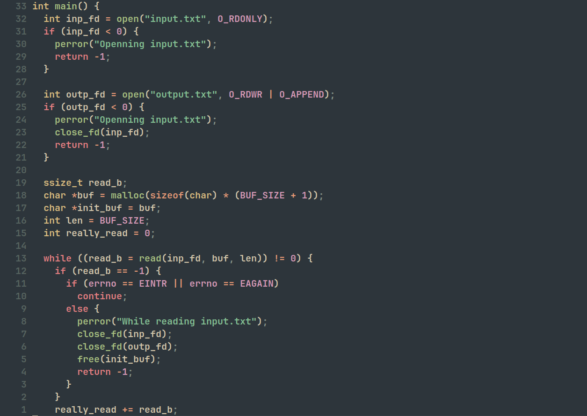
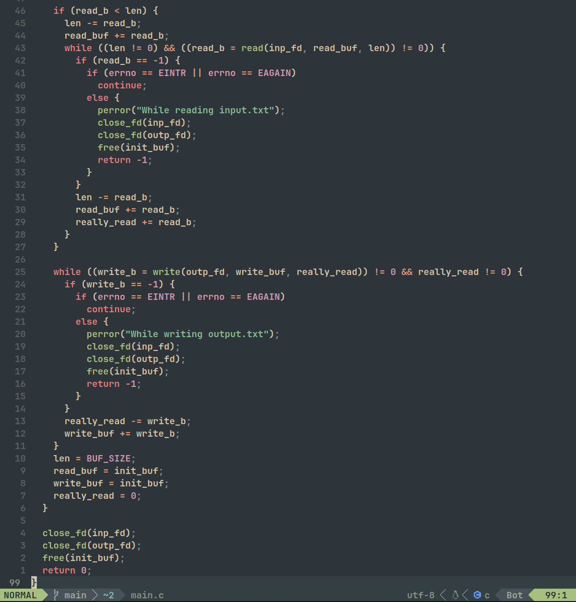

## Пояснение к выполненной задаче

### Задача
1. Прочитать информацию из одного файла;
2. Записать её в другой;
3. Предусмотреть обработку ошибок на каждом из этапов.

### Пояснение к решению
Программа сначала открывает файл ```input.txt```, проверяя, равняется ли значение, возвращённое функцией ```open()```, файловым дескриптором или значением ошибки(-1). В случае ошибки программа завершает работу.


Открывая ```output.txt```, важно в случае ошибки закрыть уже открытый ранее файл ```input.txt```, для этого используется функция ```close_fd()```, wrapper для ```close```.


Далее в цикле считываем определённое число бит и записываем их в другой файл. Если ошибка не фатальна и позволяет продолжать работу(```EINTR``` --- процесс чтения/записи был прерван, но не произошло никаких критичных ошибок, или ```EAGAIN``` --- возникает часто из-за нехватки ресурсов, повторная попытка может помочь исправить проблему).


Если в ходе считывания ```read``` вернула значение меньше, чем значение ```len```, то пытаемся повторно читать из файла. Если конец файла действительно достигнут раньше и это не какая-то ошибка, переходим к этапу записи.

Если во время чтения/записи файла возникает критичная ошибка, оба файла закрываются и программа завершает работу.
